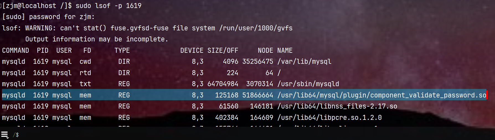
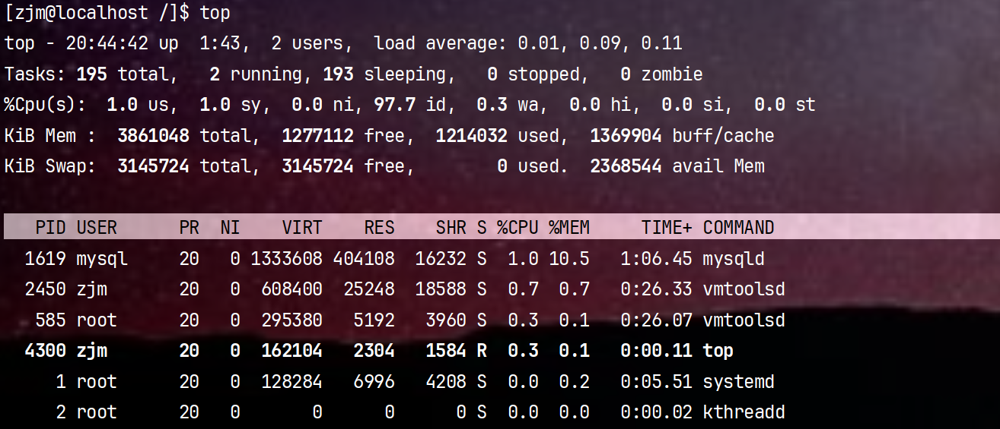

#### 系统进程相关命令

---
- `lsof` (list open files)  
查看文件、网络连接被占用情况
- `ps` 进程信息，按进程号、进程名
- `natstat` 查看网络状态

---
`sudo lsof -i`  列出当前系统中所有打开的网络连接。 
```shell
lsof -i
COMMAND PID USER   FD   TYPE DEVICE SIZE/OFF NODE NAME
sshd    123 root    3u  IPv6  4567      0t0  TCP *:22 (LISTEN)
httpd   456 apache 3u  IPv4  7890      0t0  TCP localhost:80->localhost:12345 (ESTABLISHED)
```
```shell
# 查看端口占用进程
sudo lsof -i:3306
```
`lsof -p PID`  列出特定进程所打开的文件、目录、网络连接等资源信息



---
`ps`显示进程, cmd列是启动命令

```shell
# -e 显示所有进程;-f 全格式
$ ps -ef | grep 1619
mysql      1619      1  1 19:01 ?        00:00:45 /usr/sbin/mysqld
zjm        3879   2936  0 20:07 pts/0    00:00:00 grep --color=auto 1619
```

---
`netstat`  显示网络连接、路由表和网络接口信息，可以让用户得知目前都有哪些网络连接正在运作
`netstat -apn | grep 3306`
```shell
$ netstat -apn|grep 3306
(Not all processes could be identified, non-owned process info
 will not be shown, you would have to be root to see it all.)
tcp6       0      0 :::33060                :::*                    LISTEN      -                   
tcp6       0      0 :::3306                 :::*                    LISTEN      - 
```


---

#### 资源监控
top命令
