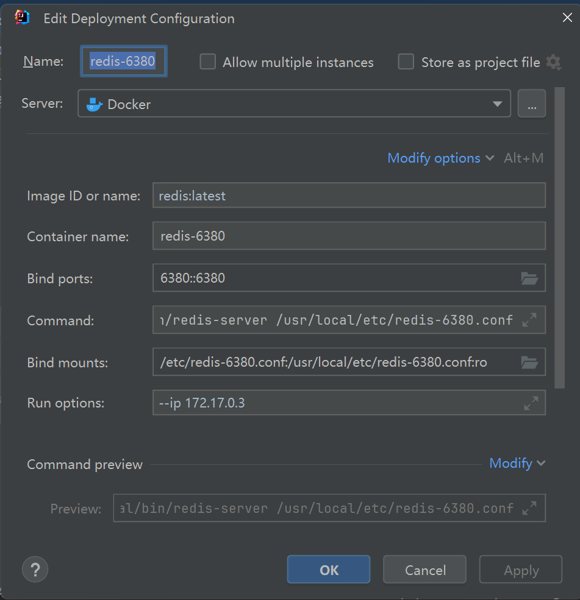

#### redis客户端连接

启动docker中的redis后，设置端口绑定，使用window本地的redis客户端操作  
客户端可执行文件 -h 主机 -p 端口

```
D:\Apps\Redis-x64-5.0.14.1\redis-cli.exe -h 192.168.172.137 -p 6379
```

#### redis主从节点搭建

在etc下新建redis-PORT.conf文件编辑内容

```properties
# 主节点也要配置
port 端口
bind 0.0.0.0
# 配置主从关系，主节点要手动考虑下，看下镜像网段选一个
replicaof 主节点ip 主节点reids端 
```

镜像文件的建议配置路径：/usr/local/etc  
启动镜像设置如下：端口、挂载、指定ip（这里的ip和前面设置的relicaof的ip要对应上，bridge模式下不能是bind后的宿主ip，设置前随便起一个镜像看下网段，手动指定下进行分配），还有就是指定command：找到redis-server进行按配置重启，放在启动命令最后，即启动后立即执行的ubuntu命令



按配置生成的构建镜像的完整命令preview如下

 ```dockerfile
  docker run -p 6380::6380 -v /etc/redis-6380.conf:/usr/local/etc/redis-6380.conf:ro --name redis-6380 --pull missing --ip 172.17.0.3 redis:latest /usr/local/bin/redis-server /usr/local/etc/redis-6380.conf
 ```

/usr/local/bin/redis-server /usr/local/etc/redis-6381.conf
docker run -p 26379::26379 -v /etc/redis-sentinel-container.conf:/usr/local/etc/redis-sentinel-container.conf:ro --name
redis-sentinel --pull missing --ip 172.17.0.5 redis:latest

#### 哨兵模式

编辑挂载指定配置

```dockerfile
sentinel monitor mymaster 172.17.0.3 6380 1
```

创建哨兵节点，启动命令conmmand设置sentinel模式

```dockerfile
docker run -p 26379::26379 -v /etc/redis-sentinel-container.conf:/usr/local/etc/redis-sentinel-container.conf --name redis-sentinel --pull missing --ip 172.17.0.5 redis:latest /usr/local/bin/redis-server /usr/local/etc/redis-sentinel-container.conf --sentinel
```

打开哨兵节点的日志可以看到监控日志，实际节点可以配置replica-priority来指定选举成为新主节点的优先级，数值越小（1-100之间）优先级越高

#### 集群搭建
docker默认的要求是集群最少有三个节点，主从复制也是同等的数字，这里就以三主三从为例介绍，首先在配置文件开启`cluster-enabled yes`，设置好端口后启动六个节点，使用config中的命令生成功能可以很方便地帮助我们快速生成容器，只需要改一改端口号就行了
注意集群模式必须是host模式
```shell
docker run -d -p 192.168.172.137:6380:6380 -p 192.168.172.137:16380:16380 -v /etc/redis-6380.conf:/usr/local/etc/redis-6380.conf --name redis-master1 --pull missing --network=host redis:latest /usr/local/bin/redis-server /usr/local/etc/redis-6380.conf; 
docker run -d -p 192.168.172.137:6381:6381 -p 192.168.172.137:16381:16381 -v /etc/redis-6381.conf:/usr/local/etc/redis-6381.conf --name redis-master2 --pull missing --network=host redis:latest /usr/local/bin/redis-server /usr/local/etc/redis-6381.conf;
docker run -d -p 192.168.172.137:6382:6382 -p 192.168.172.137:16382:16382 -v /etc/redis-6382.conf:/usr/local/etc/redis-6382.conf --name redis-master3 --pull missing --network=host redis:latest /usr/local/bin/redis-server /usr/local/etc/redis-6382.conf;
docker run -d -p 192.168.172.137:6383:6383 -p 192.168.172.137:16383:16383 -v /etc/redis-6383.conf:/usr/local/etc/redis-6383.conf --name redis-slave1 --pull missing --network=host redis:latest /usr/local/bin/redis-server /usr/local/etc/redis-6383.conf;
docker run -d -p 192.168.172.137:6384:6384 -p 192.168.172.137:16384:16384 -v /etc/redis-6384.conf:/usr/local/etc/redis-6384.conf --name redis-slave2 --pull missing --network=host redis:latest /usr/local/bin/redis-server /usr/local/etc/redis-6384.conf;
docker run -d -p 192.168.172.137:6385:6385 -p 192.168.172.137:16385:16385 -v /etc/redis-6385.conf:/usr/local/etc/redis-6385.conf --name redis-slave3 --pull missing --network=host redis:latest /usr/local/bin/redis-server /usr/local/etc/redis-6385.conf
```
搭建集群
```shell
/usr/redis-cli --cluster create --cluster-replicas 1 192.168.172.137:6380  192.168.172.137:6381  192.168.172.137:6382  192.168.172.137:6383  192.168.172.137:6384  192.168.172.137:6385
redis-cli --cluster create 192.168.172.137:6380  192.168.172.137:6381  192.168.172.137:6382  192.168.172.137:6383  192.168.172.137:6384  192.168.172.137:6385 --cluster-replicas 1
```

可以通过`cluster info`命令来查看集群信息,`cluster nodes`查看所有节点信息, `cluster reset`重置集群信息

#### redis中文教程
[redis中文教程](https://redis.com.cn/)

#### 集群下使用jedis

```java
try (JedisCluster cluster = new JedisCluster(new HostAndPort("192.168.172.137", 6380))) {
        System.out.println("集群实例数量：" + cluster.getClusterNodes().size());//6
        cluster.set("a", "yyds");
        System.out.println(cluster.get("a"));//yyds
        }
```


